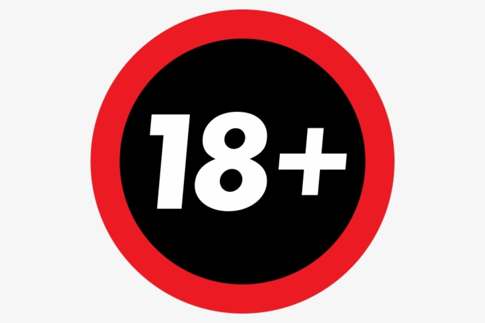

<h1 align="center">Привет я <a href="https://github.com/C0vpy4" target="_blank">C0vpy4</a> 
</h1>
<h3 align="center">Я из России 🇷🇺</h3>

Краткое описание:
Проек создан для дальнейшего использования в виде шаблона

Нобходимые условия:
 Нет
 
 Как установить:
  git clone https://github.com/C0vpy4/sites.git
 
 Как использовать:
  1. Откройте проект
  2. Отредактируйте файл lilpap`s.html под себя
<<!DOCTYPE html>
<html lang="ru">
    <head>
        <link rel="stylesheet" type="text/css" href="styles.css">
    </head>

    <body>
        

            

                

                    

                        

                            

                                
                            

                            
Lilpap`s

                            

                                

                                    
                                

                            

                        

                    

                

            

        

    </body>

    <footer>

    </footer>

</html>>

